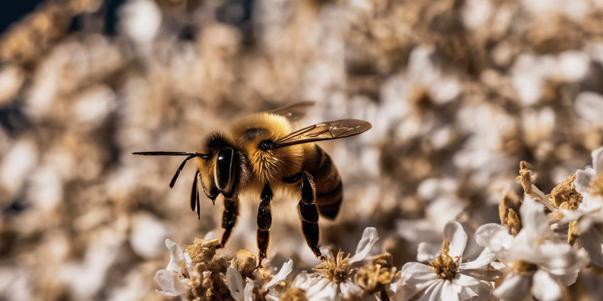

<!-- to do: activate display:none -->
<a href="https://github.com/modelearth/replicate" style="float:right;displayX:none" class="hideGit">Fork on GitHub</a>

# Storyboard Generator

## Loads prompts from CSV files / Outputs storyboard content to GitHub

[Our Storyboard Team](https://model.earth/projects/), led by Kishor and Anthony, has created a Streamlit application that transforms text prompts into storyboard gallery images and videos using the Replicate, Leonardo and other generative AI APIs. Users can enter a prompt or load prompts from a CSV file. Images are generated in different aspect ratios and can be saved directly to a GitHub repository for easy access and embedding using either our [JQuery Images Display](https://model.earth/replicate/images/) or [React Gallery](https://model.earth/react-gallery/view/).

### Features

- **Prompt Selection**: Users can choose from a variety of predefined prompts listed in a CSV file.
- **Image Generation**: The app generates images based on the selected prompt using the Replicate model.
- **Multiple Aspect Ratios**: Supports the creation of images in square and horizontal formats.
- **GitHub Integration**: Automatically saves generated images to a specified GitHub repository.

## Getting Started

### Prerequisites

- Streamlit
- Pandas
- Replicate Python Client
- Python Requests
- Pillow (PIL)

### Installation

1.) Clone the repository to your local computer.

2.) Navigate to the directory, start a virtual env, and install the required packages:
   
   ```bash
   python3 -m venv env && source env/bin/activate &&
   pip install -r requirements.txt
   ```

3.) Save a copy of example_secrets.toml as secrets.toml

4.) If you will be sending files to your GitHub account, in .streamlit/secrets.toml add:

GITHUB\_TOKEN
GITHUB\_REPOSITORY

To create a GITHUB_TOKEN, in GitHub.com go to: Settings -> Developer Settings -> [Personal access tokens](https://github.com/settings/tokens).  
Checking the first three checkboxes should suffice: repo, workflow and write:packages

The GITHUB_REPOSITORY would be one your own repo, in this format:

   https://github.com/[your account]/[your repo]

5.) Set your Replicate API Token in .streamlit/secrets.toml. 

You can get a free [Replicate API Token](https://replicate.com/docs/reference/http#authentication), but they are slow. [Purchased tokens](https://replicate.com/pricing) are affordable.

6.) Update the CSV file with your prompts.

7.) Run the Streamlit app:
   ```bash
   streamlit run streamlit_app.py
   ```
Or run the .csv prompt input version:
   ```bash
   streamlit run code_gen_images_sq_wide_ME.py
   ```

8.) Open the Streamlit app in your web browser.

9.) Use the sidebar to select a prompt from the CSV file.

10.) Click on 'Generate Image' to start the image generation process.

11.) View the generated images in different aspect ratios.

12.) Check your GitHub repository for the saved images.


## Contributing

Contributions to improve this project are welcome. Please follow these steps:

1. Fork the repository.
2. Create a new branch for your feature or fix.
3. Commit your changes.
4. Push to the branch.
5. Open a pull request.