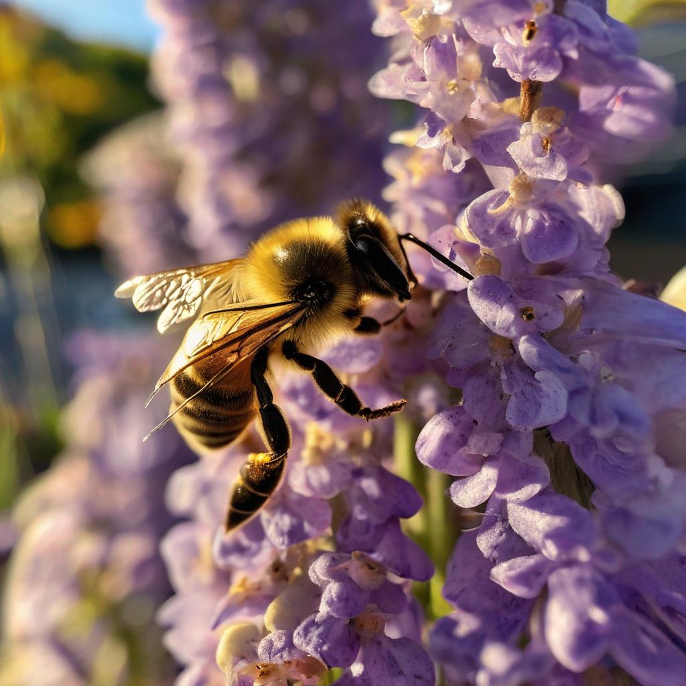

# README for "Replicate Image Generator based on CSV Input" Project


[

## Project Overview

"Replicate Image Generator based on CSV Input" is a Streamlit application designed to transform text prompts into stunning visual images using the Replicate API. This application reads prompts from a CSV file, allows users to select a prompt, and generates images in different aspect ratios. The images are then saved to a GitHub repository for easy access and sharing.

### Features

- **Prompt Selection**: Users can choose from a variety of predefined prompts listed in a CSV file.
- **Image Generation**: The app generates images based on the selected prompt using the Replicate model.
- **Multiple Aspect Ratios**: Supports the creation of images in square and horizontal formats.
- **GitHub Integration**: Automatically saves generated images to a specified GitHub repository.

## Getting Started

### Prerequisites

- Streamlit
- Pandas
- Replicate Python Client
- Python Requests
- Pillow (PIL)

### Installation

1. Clone the repository:
   ```bash
   git clone https://github.com/mannurkishorreddy/streamlit-replicate-img-app.git
   ```

2. Navigate to the cloned directory and install the required packages:
   ```bash
   pip install -r requirements.txt
   ```

3. Run the Streamlit app:
   ```bash
   streamlit run app.py
   ```

## Usage

1. Open the Streamlit app in your web browser.
2. Use the sidebar to select a prompt from the CSV file.
3. Click on 'Generate Image' to start the image generation process.
4. View the generated images in different aspect ratios.
5. Check the GitHub repository for the saved images.

## Configuration

- **API Tokens**: Set your Replicate and GitHub API tokens in the `.streamlit/secrets.toml` file.
- **CSV File**: Update the CSV file with your prompts as needed.

## Contributing

Contributions to improve this project are welcome. Please follow these steps:

1. Fork the repository.
2. Create a new branch for your feature or fix.
3. Commit your changes.
4. Push to the branch.
5. Open a pull request.

## License

This project is licensed under the MIT License - see the [LICENSE](LICENSE) file for details.

## Acknowledgments

- Replicate for the image generation model.
- Streamlit for the interactive web app framework.
- GitHub for repository hosting and image storage.
